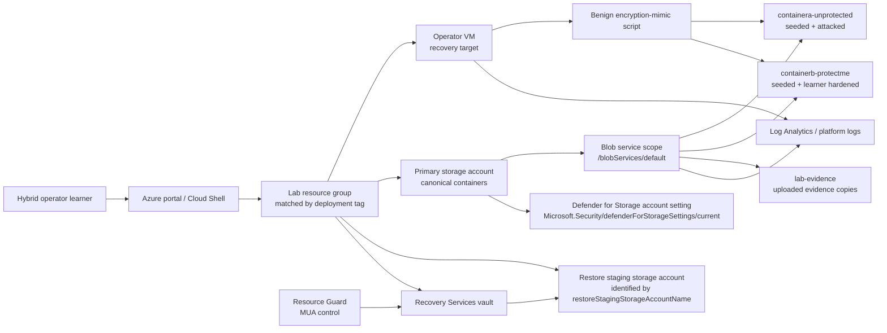

# Getting Started: Ransomware Resilience — Hardening Azure Workloads End to End

## Lab scenario

You are the hybrid operator for a small Azure workload that has experienced a ransomware-style tampering simulation. Your responsibility spans both sides of resilience: harden the environment before the next attempt, collect credible evidence, and prove that recovery controls work when a workload must be restored.

The lab starts in a partially compromised state. One blob container was attacked automatically during deployment, while a second identically seeded container is waiting for you to harden it. You will use the same benign encryption-mimic workflow against both containers so you can compare a successful tamper event with a blocked or rejected tamper event.

This is an advanced, self-paced challenge lab. The guide gives outcomes, constraints, and evidence expectations rather than click-by-click portal narration. Use the Azure portal, Cloud Shell, PowerShell, Azure Monitor, Blob service logs, backup job history, and Microsoft Defender for Cloud evidence where available.

## Safety framing for the mimic

The attack workflow in this lab is a **benign encryption mimic**. It is included so you can reason about ransomware resilience without introducing real malware.

- It runs only inside your isolated CloudLabs Azure sandbox.
- It targets lab-seeded sample blobs, not production data.
- It creates observable tampering behavior such as attempted overwrites, rejected writes, output logs, and platform telemetry.
- It does not contain a real ransomware payload, persistence mechanism, credential stealer, worm, or destructive host malware.

Treat the evidence as an incident simulation: investigate it, contain the affected access path, harden the remaining target, and validate recovery.

## Lab duration and timing expectations

Estimated total duration: **180 minutes**.

The lab is intentionally sized as a full 180-minute challenge. Use the exact allocation below when planning your work:

| Challenge | Focus | Allocated duration |
|---|---|---:|
| Challenge 1 | Establish resilient backup governance | 25 minutes |
| Challenge 2 | Harden Container B and the VM against tampering | 25 minutes |
| Challenge 3 | Prove the authorization boundary holds | 20 minutes |
| Challenge 4 | Attack Container B and prove protection blocked tampering | 30 minutes |
| Challenge 5 | Investigate the ransomware signal and rotate access | 25 minutes |
| Challenge 6 | Restore the VM, validate integrity, and produce a recovery runbook | 55 minutes |
| **Total** |  | **180 minutes** |

Azure control-plane operations and security analytics are asynchronous. Plan your work with these timing caveats in mind:

- **Microsoft Defender for Storage alerts are asynchronous and signal-dependent.** Defender for Storage continuously analyzes storage telemetry and can raise alerts for suspicious access, data corruption, unusual deletion, malware upload, and related scenarios. This lab's benign overwrite mimic is intentionally safe and may not satisfy Defender's alerting conditions during your session. Challenge 5 therefore has two equal planned completion paths: investigate any Defender alert if one appears, or perform manual hunting and evidence correlation from storage state, script output, Activity Log, Blob service diagnostic logs, and timestamps if no alert is produced.
- **Azure Backup jobs and VM restore operations take meaningful time.** The deployment starts or attempts a same-session backup job for the VM. Later, when you restore the VM in Challenge 6, the **55-minute allocation includes the mostly passive Azure VM restore wait**. Monitor progress rather than assuming the job has failed because it is not immediate. A restore job that remains `InProgress` while Azure is still updating progress is not a failure.
- **Use restore wait time productively.** While Azure processes the restore in Challenge 6, prepare the checksum-validation commands, draft the recovery-runbook sections, organize earlier evidence, and list any rollback or cleanup notes you will need once the restore completes.
- **Only one VM recovery point is expected.** The lab creates a recovery point during the same lab session. You are not working with a multi-day backup history.

## Sign in to Azure

1. Open <https://portal.azure.com>.
2. Sign in with the single supplied Microsoft Entra learner identity:
   - Username: <inject key="AzureAdUserEmail"></inject>
   - Password: <inject key="AzureAdUserPassword"></inject>
3. Confirm you are operating in the expected tenant and subscription:
   - Tenant ID: <inject key="TenantID"></inject>
   - Subscription ID: <inject key="SubscriptionID"></inject>
4. Use the CloudLabs deployment identifier **<inject key="DeploymentID" enableCopy="false"/>** as the exact value for resource-group discovery tags. Do not infer the resource group from a fixed name prefix or from a partial name match.

> [!Important]
> Do not paste CloudLabs inject values into code blocks in your notes. They are session-specific credentials and identifiers.

## Identity and approval model for the MUA challenge

Challenge 3 uses the **single supplied Microsoft Entra learner identity** to observe the Resource Guard authorization boundary. The learner identity can discover the Resource Guard relationship and gather nonsecret evidence, but it is intentionally not supplied with standing Contributor, Backup MUA Admin, or Backup MUA Operator authority on the Resource Guard.

The local trainer/instructor account, if visible in the CloudLabs environment, is a **VM Shadow support account only**. It is used for VM access support and is never a Microsoft Entra approver, never a Resource Guard security administrator, and never an identity you should use to approve MUA-protected backup operations.

Challenge 3 does **not** perform a full MUA approval workflow. A complete enterprise approval flow is conceptual in this lab and would require separately provisioned identity and governance components that are not supplied here:

- A separate approver identity with Resource Guard authority.
- An eligible Backup MUA Operator assignment for the requester on the Resource Guard.
- Microsoft Entra Privileged Identity Management activation with approval.
- Time-bound access and cleanup after the approved window expires.
- Separation ensuring the vault administrator does not hold standing Contributor, Backup MUA Admin, or Backup MUA Operator authority on the Resource Guard.

Your outcome in Challenge 3 is therefore an attributable authorization denial for a safe path toward a protected destructive backup action, plus a written explanation of the conceptual approval flow and why separation of duties matters during ransomware response.

> [!Important]
> Multi-user authorization (MUA) protects specific critical Azure Backup operations through Resource Guard. It does **not** block all administrative access, and it does not protect direct operations on the original VM, disks, storage account, or blobs outside the scoped backup operation.

## Architecture

## What is deployed for you

Your sandbox contains the core resources needed to investigate, harden, attack, detect, and recover:

| Component | Purpose in the lab |
|---|---|
| Azure VM | Serves as the operator workstation and the VM recovery target. Bootstrap scripts place lab tools and evidence files on the VM. |
| Primary storage account | Hosts the seeded blob containers and evidence container used for the ransomware-resilience challenges. This is the only non-staging storage account in the matched resource group that contains all three canonical containers. |
| Dedicated restore staging storage account | Supports VM restore staging. Identify it only from the exact ARM output or CloudLabs inject contract named `restoreStagingStorageAccountName`; do not use it for blob-container hardening, mimic testing, evidence upload, Defender for Storage review, or storage key rotation in Challenges 2–5. |
| `containera-unprotected` | Seeded during deployment and attacked automatically during deployment. It remains intentionally unprotected so you can investigate successful tampering. |
| `containerb-protectme` | Seeded with the same initial content as Container A but not attacked during deployment. You harden it before launching the second mimic attempt. |
| `lab-evidence` | Stores uploaded copies of bootstrap evidence such as checksum references and the Container A attack output. |
| Benign encryption-mimic script | Parameterized PowerShell script reused for both containers. It provides comparable command output for the successful and blocked outcomes. |
| Recovery Services vault | Provides Azure VM backup and restore workflows for the lab recovery scenario. |
| Resource Guard | Supports MUA scenarios for selected high-impact Azure Backup operations. In this lab it is used to prove the authorization boundary with one learner identity, not to run a complete requester/approver approval transaction. |
| Microsoft Defender for Storage | Deployed as an account-scoped resource named `Microsoft.Security/defenderForStorageSettings/current` at API version `2025-01-01` on the primary lab storage account. It provides storage threat-detection analytics when storage telemetry matches supported alert conditions. An alert is useful evidence if produced, but manual hunting is an equally planned path in this lab. |
| Azure Monitor / diagnostic logs | Provides platform-log evidence for storage operations, backup activity, and VM-related investigation. Storage diagnostic evidence for blob operations is collected and interpreted at the primary storage account Blob service resource scope: `&lt;storage-account-id&gt;/blobServices/default`. |

## Canonical lab names and paths

Use the deployment ID **<inject key="DeploymentID" enableCopy="false"/>** as the exact value when you search Azure resource-group tags. The exact storage account, VM, vault, workspace, and resource guard names include generated values and must be discovered from the one matching resource group rather than guessed from a fixed prefix or name substring. The following names and paths are fixed by the lab design:

| Item | Canonical value |
|---|---|
| Dedicated restore staging storage account identifier | Exact ARM output or CloudLabs inject key named `restoreStagingStorageAccountName` |
| Unprotected container | `containera-unprotected` |
| Container to harden | `containerb-protectme` |
| Evidence container | `lab-evidence` |
| Blob service diagnostic scope | `&lt;storage-account-id&gt;/blobServices/default` on the primary storage account |
| Environment file on VM | `C:\LabFiles\RansomwareResilience\.env` |
| Desktop copy of environment file | `C:\Users\Public\Desktop\RansomwareResilience.env` |
| Benign mimic script | `C:\LabFiles\RansomwareResilience\Scripts\Invoke-BenignBlobEncryptionMimic.ps1` |
| Container A attack output | `C:\LabFiles\RansomwareResilience\Evidence\container-a-attack-output.json` |
| Checksum reference JSON | `C:\LabFiles\RansomwareResilience\Evidence\checksum-reference.json` |
| Checksum reference CSV | `C:\LabFiles\RansomwareResilience\Evidence\checksum-reference.csv` |
| Backup bootstrap status | `C:\LabFiles\RansomwareResilience\Evidence\vm-backup-bootstrap-status.json` |
| Bootstrap summary | `C:\LabFiles\RansomwareResilience\Evidence\bootstrap-summary.json` |

Uploaded evidence copies in `lab-evidence` use the `bootstrap/` prefix, including `bootstrap/checksum-reference.json`, `bootstrap/checksum-reference.csv`, `bootstrap/container-a-attack-output.json`, `bootstrap/vm-backup-bootstrap-status.json`, and `bootstrap/bootstrap-summary.json`.

## Storage-account selection contract

This lab has a deterministic contract for distinguishing the two storage accounts. Use this contract consistently in every challenge:

1. The **dedicated restore staging storage account** is identified only by the exact ARM output or CloudLabs inject key named `restoreStagingStorageAccountName`. It exists for VM restore staging and is not the primary data account for the blob-container challenges.
2. The **primary storage account** is the sole non-staging storage account inside the exact matched resource group that contains all three canonical containers: `containera-unprotected`, `containerb-protectme`, and `lab-evidence`.
3. To resolve the primary account, first resolve the exact lab resource group, then enumerate storage accounts in that resource group, exclude the account whose name equals the `restoreStagingStorageAccountName` contract value, and verify that exactly one remaining storage account contains all three canonical containers.
4. If the staging account name cannot be resolved, or if zero or multiple non-staging storage accounts contain the three canonical containers, stop the lab and re-check the deployment outputs, tenant, subscription, and resource-group discovery. Do not choose a closest-looking storage account.

No storage account selection in this lab is based on list order, first match, prefix, substring, or generated-name guesswork. The restore staging account is identified by the exact `restoreStagingStorageAccountName` output/inject contract, and the primary account is identified by the canonical-container membership test after the staging account is excluded.

## Resource-group orientation

Every challenge uses the same resource-group orientation rule:

1. Discover candidate resource groups by using the exact deployment ID **<inject key="DeploymentID" enableCopy="false"/>** against resource-group tags named `deploymentId` or `DeploymentID`.
2. Deduplicate candidates after checking both tag names, because the same resource group might be returned through more than one matching tag path.
3. Require exactly one matching resource group before continuing. If zero or multiple resource groups match, stop and re-check the deployment ID, tenant, subscription, and tag query instead of choosing the closest-looking name.
4. Treat the single matching resource group as the authoritative scope for the challenge, then discover the VM, primary storage account, dedicated restore staging storage account, Recovery Services vault, Resource Guard, Log Analytics workspace, and related resources inside that group.

No fixed resource-group prefix, naming convention, or name substring is authoritative for this lab. The exact `deploymentId` or `DeploymentID` tag match is the source of truth.

Within the matched resource group, identify these resources and evidence sources:

1. The Azure VM used for the operator and restore workflow.
2. The primary storage account containing `containera-unprotected`, `containerb-protectme`, and `lab-evidence`.
3. The dedicated restore staging storage account identified by the exact `restoreStagingStorageAccountName` output/inject contract; keep it separate from primary storage evidence and key-rotation work.
4. `containera-unprotected`, which should already show signs of deployment-time tampering.
5. `containerb-protectme`, which should still match the original seed state until you harden and test it.
6. The Recovery Services vault protecting the VM.
7. The Resource Guard associated with MUA governance.
8. The Defender for Storage account-scoped configuration represented by `Microsoft.Security/defenderForStorageSettings/current` at API version `2025-01-01` on the primary storage account, plus any storage alerts that may exist.
9. Azure Monitor logs, Activity Log records, Blob service diagnostic outputs at `&lt;storage-account-id&gt;/blobServices/default` on the primary storage account, or saved script output that can support your evidence pack.

> [!Tip]
> Keep a short evidence journal as you work. Record the resource name, timestamp, operation, result, and screenshot-free summary of what the evidence proves. You will need this in the later challenges and the final recovery runbook.

## Access, JIT, and monitoring expectations

The lab VM has a standing inbound RDP rule named for CloudLabs access. Treat that rule as a **CloudLabs access exception** that allows you to connect to the sandbox VM; it is not proof that Microsoft Defender for Cloud just-in-time VM access is active.

Do not enable a subscription-wide Microsoft Defender for Servers Plan 2 solely for this lab. Defender for Servers Plan 2 is required for Defender for Cloud JIT and file integrity monitoring features in production scenarios, but this package does not require you to turn on subscription-wide Plan 2. Use the deployed Azure Monitor agent, Log Analytics workspace, Blob service diagnostic settings at `&lt;storage-account-id&gt;/blobServices/default` on the primary storage account, Activity Log, backup jobs, and local evidence files for the investigation paths described in the challenges.

## Lab objectives

By the end of the lab, you will be able to:

- Establish Azure Backup governance controls for an Azure VM, including soft delete and Resource Guard-backed MUA scope reasoning.
- Explain which backup operations MUA protects and why it is not a complete administrative safeguard.
- Observe a Resource Guard authorization boundary using the single supplied Microsoft Entra learner identity.
- Explain the conceptual MUA approval flow without performing it: separate approver authority, requester eligible Backup MUA Operator assignment, PIM activation with approval, time-bound access, and cleanup.
- Configure tamper resistance on `containerb-protectme` at the **container level**, not at the storage-account level.
- Explain the limits of an unlocked time-based immutability policy: it can provide overwrite/delete resistance, but an authorized principal may still modify or remove an unlocked policy.
- Prove that the same benign mimic succeeds against `containera-unprotected` and is rejected or neutralized against `containerb-protectme` after hardening.
- Correlate three evidence types: storage state, script or command output, and Azure platform logs or security signals.
- Investigate Defender for Storage findings when present, or complete manual hunting and evidence correlation when no alert is produced.
- Rotate impacted primary storage account access keys as a containment action.
- Restore the VM from the single same-session recovery point and validate integrity with checksum-friendly files.
- Produce a practical ransomware-recovery runbook.

## Challenge map

| Challenge | Duration | Focus | Primary outcome |
|---|---:|---|---|
| Challenge 1 | 25 minutes | Backup governance | Vault protections, soft delete, Resource Guard/MUA posture, and accurate scope statement. |
| Challenge 2 | 25 minutes | Tamper hardening | Container-level immutability on `containerb-protectme` and evidence-ready VM/storage monitoring posture. |
| Challenge 3 | 20 minutes | Resource Guard authorization boundary | Authorization denial for the single supplied learner identity when approaching a protected destructive backup action, plus a conceptual explanation of the full approval flow that would require a separate approver, eligible Backup MUA Operator assignment, PIM activation/approval, time-bound access, and cleanup. |
| Challenge 4 | 30 minutes | Protected attack comparison | The benign mimic succeeds against A and is blocked against B, with mixed evidence across both containers. |
| Challenge 5 | 25 minutes | Detection and containment | Defender for Storage investigation when present, or manual hunting when no alert is produced, followed by primary storage account key rotation. |
| Challenge 6 | 55 minutes | Recovery and runbook | VM restore from the single same-session recovery point, integrity validation, and an operational runbook. The 55 minutes includes the mostly passive Azure restore wait; prepare runbook/checksum work while the restore job progresses. |
| **Total** | **180 minutes** |  |  |

## Accuracy rules for this lab

Keep these constraints in your notes and final explanations:

- This environment supplies one Microsoft Entra learner identity. Challenge 3 observes the Resource Guard authorization boundary; it does not perform a full approval flow.
- The local trainer/instructor account is VM Shadow only and is never a Microsoft Entra approver or Resource Guard approval identity.
- A full MUA approval flow would require a separately provisioned approver identity with Resource Guard authority, an eligible Backup MUA Operator assignment for the requester, PIM activation with approval, and time-bound activation followed by cleanup.
- Vault administrators must not hold standing Contributor, Backup MUA Admin, or Backup MUA Operator permissions on the Resource Guard.
- MUA adds approval requirements for selected critical Azure Backup operations. It is not a universal administrative lockout mechanism.
- Resource Guard protects scoped backup operations; it does not prevent all direct actions against the VM, disks, storage account, or blobs.
- `containerb-protectme` immutability must be configured at the **container scope**. Do not use storage-account-level immutability for this challenge.
- An unlocked time-based immutability policy is not absolute protection. It can still be modified or removed by an authorized principal.
- `containera-unprotected` is the positive control: the mimic already ran there during deployment and should show the unprotected impact.
- `containerb-protectme` is the protected control: harden it first, then run the same mimic and prove the outcome changed.
- The dedicated restore staging storage account is not the primary data account. Identify staging only by the exact `restoreStagingStorageAccountName` output/inject contract, then identify the primary account as the sole non-staging account in the exact matched resource group that contains `containera-unprotected`, `containerb-protectme`, and `lab-evidence`.
- Stop instead of guessing if the staging account or primary account cannot be resolved unambiguously.
- Defender alert arrival is not guaranteed and this benign overwrite may produce no alert. Manual hunting is an equal planned path, not a timeout fallback.
- The VM restore uses the lab-created same-session recovery point. Do not invent older recovery points in your analysis.
- The standing RDP rule supports CloudLabs access and should not be cited as evidence that JIT is configured.
- Resource-group selection must be based on exactly one deduplicated match for the exact `deploymentId` or `DeploymentID` tag value, not on a name prefix or partial name search.
- VM restore progress is evaluated by job state and progress details. A job that is still `InProgress` while Azure continues processing is not failed merely because the restore wait is taking time.

## Recommended working method

1. Discover the resource group by exact `deploymentId` or `DeploymentID` tag value, deduplicate the candidate list, and continue only after exactly one resource group matches **<inject key="DeploymentID" enableCopy="false"/>**.
2. Open the matched resource group and identify the VM, primary storage account, dedicated restore staging storage account, Recovery Services vault, Resource Guard, and Log Analytics workspace. Use the storage-account selection contract in this guide; do not use list order, first match, prefixes, substrings, or generated-name guesses.
3. Review `C:\LabFiles\RansomwareResilience\.env` on the VM to capture the generated resource names for your run.
4. Use `C:\LabFiles\RansomwareResilience\Evidence\checksum-reference.json` as the original seed manifest for integrity comparisons.
5. Use `C:\LabFiles\RansomwareResilience\Evidence\container-a-attack-output.json` as the deployment-time positive-control attack output.
6. Prefer concise evidence over screenshots: state the control, the observed result, and why it proves or disproves the expected outcome.
7. Start long-running backup or restore activities early when the challenge permits, then continue gathering evidence while Azure completes the operation.
8. In Challenge 5, investigate a Defender for Storage alert if one exists. If no alert exists, complete the planned manual-hunting path by verifying the account-scoped Defender for Storage configuration through `Microsoft.Security/defenderForStorageSettings/current` at API version `2025-01-01` on the primary storage account, inspecting telemetry including Blob service diagnostic data at `&lt;storage-account-id&gt;/blobServices/default`, recording timestamps, and correlating storage/script/log evidence.
9. In Challenge 6, start the restore from the single same-session recovery point, monitor job progress, and use the passive wait to prepare the checksum-validation evidence and runbook structure. Treat `InProgress` as expected while progress continues; move to checksum validation after the restore artifacts are available.

## Prerequisites

You should already be comfortable with:

- Azure portal navigation and Azure resource relationships.
- Azure Storage accounts, blob containers, access keys, blob writes, and immutability concepts.
- Azure Backup concepts including Recovery Services vaults, VM backup items, recovery points, and restore jobs.
- Security operations practices such as least privilege, key rotation, incident notes, evidence correlation, and recovery validation.
- Reading PowerShell output and interpreting Azure Monitor, Activity Log, Defender for Cloud, Blob service diagnostic logs, and backup-job state.

## How to proceed

Begin with **Challenge 1**. Work through the challenges in order because later challenges depend on evidence and controls established earlier. The final challenge asks you to consolidate your work into a recovery runbook, so maintain clear notes from the beginning.

## After publishing

> [!Note] These steps run **after** you push the template to CloudLabs — they verify CloudLabs can actually serve this lab guide to candidates.

- **Verify docs-proxy access:** open Templates → your template → **Lab Guide Settings** in <https://admin.cloudlabs.ai> and confirm CloudLabs can reach this repo via the docs proxy. If the repo is private, configure GitHub access at the template level.
- **Verify inline questions and inline validations:** sign in to <https://admin.cloudlabs.ai>, open your template, and walk through one full lab run to confirm every `<question>` and `<validation step="..."/>` renders correctly. Fix any that don't resolve.
